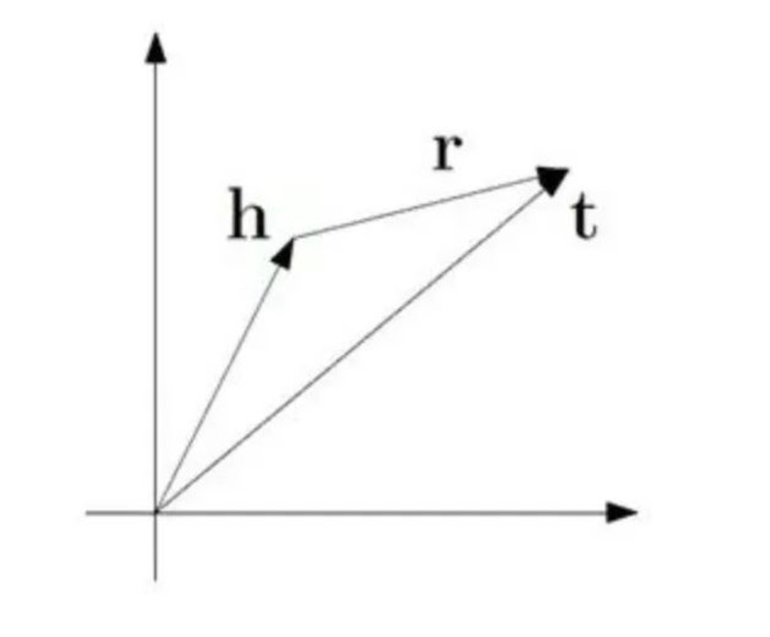
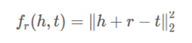
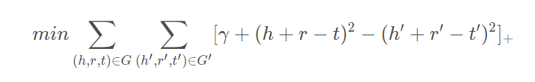
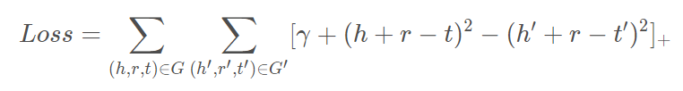
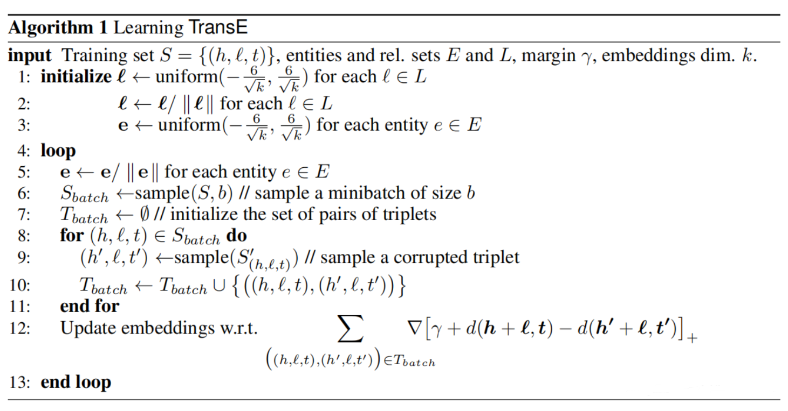
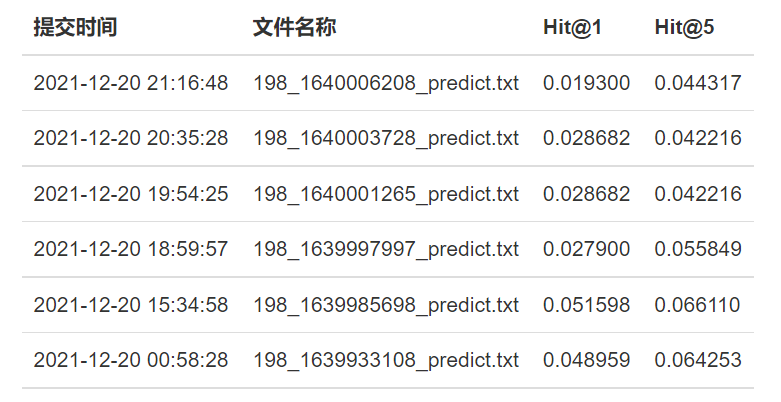

# Web实验二: 知识图谱生成实践

PB19051033 孙远林 PB19111675 德斯别尔

### 实验背景：
知识图谱是一种特殊的图数据，图中的结点代表实体，边代表关系。一个知识图谱可以由一系列 <头实体，关系，尾实体>三元组来表示。通常情况下，知识图谱中的三元组并不完整，我们需要根据已知的三元组，来推测出残缺甚至未知的三元组。
### 实验目的:
本实验要求在给定的带有文本描述的知识图谱数据集上，设计一种知识图谱补全算法。需要在给定的测试集上，预测出缺失的三元组的尾实体。

### 实验任务：
在本实验中，需要实现一种利用文本信息的知识图谱的补全方法。此处不限制以何种方法或何种算法使用文本内容，可以自由探索（如使用word2vec计算语义的相似度）。

### 实验步骤：

#### method1: TransE

###### 基本思想

TransE是一篇Bordes等人2013年发表在NIPS上的文章提出的算法。它的提出，是为了解决多关系数据（multi-relational data）的处理问题。我们现在有很多很多的知识库数据knowledge bases (KBs)，比如Freebase、 Google Knowledge Graph 、 GeneOntology等等。
TransE的直观含义，就是TransE基于实体和关系的分布式向量表示，将每个三元组实例（head，relation，tail）中的关系relation看做从实体head到实体tail的翻译，通过不断调整h、r和t（head、relation和tail的向量），使（h + r） 尽可能与 t 相等，即 h + r = t。


###### 算法原理

使head向量和relation向量的和尽可能靠近tail向量。用L1或L2范数来衡量它们的靠近程度。

 

令：
(h,r,t)：表示正确的三元组
(h',r',t')：表示错误的三三元组
γ ：表示正样本和负样本之间的间距，一个常数
$[x]_+$ ：表示max(0,x)

我们的目标是让正例的距离最小，也就是min(distance(h+r,t))，让负例的相反数最小也就是(min(-distance(h'+r',t')))，对于每一个正样本和负样本求和，再增加一个常数的间距，就是整体距离的最小值。也就是目标函数。

目标函数为：

 

采用欧氏距离作为distance函数，则目标函数可以改写为：

 

则对于损失函数loss就有：

 

###### 如何产生负样本

随机替换三元组中的头实体或着尾实体(每次操作具体替换头实体还是尾实体也是随机选择的)

###### 算法步骤
TransE算法可划分为表示向量初始化（步骤1—步骤3）、批训练数据集构建（步骤6—步骤11）和表示向量更新（步骤12、步骤5）三部分。

表示向量初始化（步骤1—步骤3）采用k维随机均匀分布对每个实体和每个关系进行初始化。
批训练数据集构建（步骤6—步骤11）则从训练集合中随机选出正面样本（h,r,t），然后基于正面样本，保持正面样本中h，r或r，t不变，改变t或h，获得负面样本，合并一起构成批批训练数据集。
表示向量更新（步骤12、步骤5）则采用随机梯度下降法，对批训练数据集中正面样本（h,r,t）和负样本的向量表示进行更新。
TranE直接对向量表示进行训练，每个实体（head或tail）对应一个k维向量，每个关系对应一个k维向量，所有的k维向量即为TransE模型的参数，需要训练的参数。

###### 向量的初始化

因为并不知道向量的具体分布形式，所以选择随机初始化，是其形成平均分布。

```
  def emb_initialize(self):
        relation_dict = {}
        entity_dict = {}
        for relation in self.relation:
            r_emb_temp = np.random.uniform(-6 / math.sqrt(self.embedding_dim),
                                           6 / math.sqrt(self.embedding_dim),
                                           self.embedding_dim)
            relation_dict[relation] = r_emb_temp / np.linalg.norm(r_emb_temp, 
ord=2)
        for entity in self.entity:
            e_emb_temp = np.random.uniform(-6 / math.sqrt(self.embedding_dim),
                                           6 / math.sqrt(self.embedding_dim),
                                           self.embedding_dim)
            entity_dict[entity] = e_emb_temp / np.linalg.norm(e_emb_temp, ord=2)
```

###### 参数的选取：

#### method2: word2vec + TransE

为使用实验文档所给的语义信息，选择使用word2vec对向量进行初始化，效果不佳，最终放弃。

#### 实验总结

##### 实验结果
实验结果并非很理想，最佳的一次结果为：
Hit@1：0.051  Hit@5: 0.066110

##### 实验收获
第一次接触机器学习领域，不知从何下手，且对影响结果的因素不了解，有许多想不明白的地方，在此方向上的学习还需继续努力。虽然结果不佳，但也有了许多收获，相信在lab3中，我们小队一定可以做到更好。
